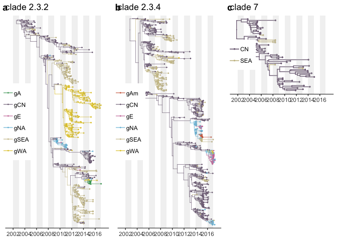
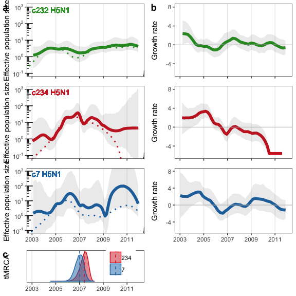
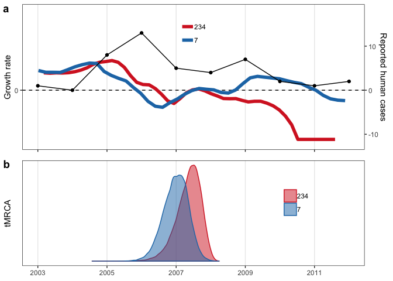
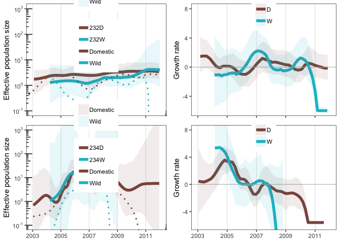
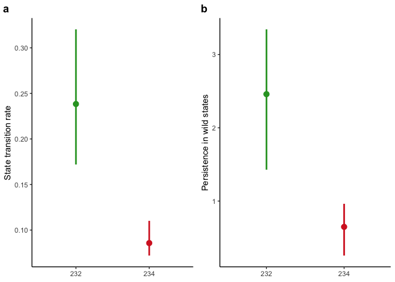
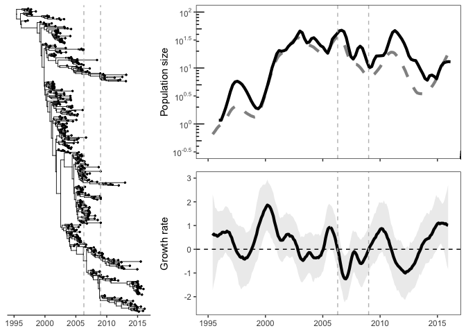

``` r
source( "./function.R" )
require( ape )
require( tidyverse )
require( ggtree )
require( ggpubr )
require( seqinr )
```

### Figure 1. Geographical distributions of Goose/Guangdong/96-like H5 avian influenza viruses.

``` r
c234_geo.tre <- "./beast/tree/geo_234_h5-anno.tre"
c232_geo.tre <- "./beast/tree/geo_232_h5-anno.tre"
c7_geo.tre   <- "./beast/tree/geo_7_h5-anno.tre"

# c234 tre

rawbeast.c234 <- read.beast( c234_geo.tre )

t1 <- 
ggtree( rawbeast.c234, right = TRUE, size = 0.25, mrsd = "2017-04-18" ) + 
  aes( color = states ) + 
  geom_tippoint(size = 0.25) +
  theme_tree2( axis.text.x = element_text(), 
               legend.title = element_blank(),
               legend.position = c(0.1,0.5) ) + 
  scale_x_continuous( breaks = seq(2002, 2017, by = 2), 
                      labels = seq(2002, 2017, by = 2),
                      limit  = c(2001.5, 2017.5) )  + 
  scale_y_continuous( expand = c(0,10) ) + 
  scale_color_manual( values =  c( "#d0694a",
                                   "#7f6e85",
                                   "#cc79a7",
                                   "#77bedb",
                                   "#ccc197",
                                   "#e1c72f" ) )

recdf <- data.frame( xstart = seq(2002, 2017, 2),
                     xend   = seq(2003, 2018, 2) )

t11 <- t1 + geom_rect( data = recdf, aes( xmin = xstart, xmax = xend, ymin = -Inf, ymax = Inf),
                       fill = "gray", alpha = 0.2, inherit.aes = FALSE) + 
       ggtitle( "clade 2.3.4" )


# c232 tre

rawbeast.c232 <- read.beast( c232_geo.tre )

t2 <- 
  ggtree( rawbeast.c232, right = TRUE, size = 0.25, mrsd = "2017-01-01" ) + 
  aes( color = states ) + 
  geom_tippoint(size = 0.25) +
  theme_tree2( axis.text.x = element_text(), 
               legend.title = element_blank(),
               legend.position = c(0.1,0.5) ) + 
  scale_x_continuous( breaks = seq(2002, 2017, by = 2), 
                      labels = seq(2002, 2017, by = 2),
                      limit  = c(2001.5, 2017.5) ) + 
  scale_y_continuous( expand = c(0,10) ) + 
  scale_color_manual( values =  c( "#48a365",
                                   "#7f6e85",
                                   "#cc79a7",
                                   "#77bedb",
                                   "#ccc197",
                                   "#e1c72f" ) )

recdf <- data.frame( xstart = seq(2002, 2017, 2),
                     xend   = seq(2003, 2018, 2) )

t22 <- t2 + geom_rect( data = recdf, aes( xmin = xstart, xmax = xend, ymin = -Inf, ymax = Inf),
                       fill = "gray", alpha = 0.2, inherit.aes = FALSE) + 
  ggtitle( "clade 2.3.2" )


# c7 tree

rawbeast.c7 <- read.beast( c7_geo.tre )

t3 <- 
  ggtree( rawbeast.c7, right = TRUE, size = 0.5, mrsd = "2015-01-15" ) + 
  aes( color = states ) + 
  geom_tippoint(size = 0.5) +
  theme_tree2( axis.text.x = element_text(), 
               legend.title = element_blank(),
               legend.position = c(0.1,0.5) ) + 
  scale_x_continuous( breaks = seq(2002, 2017, by = 2), 
                      labels = seq(2002, 2017, by = 2),
                      limit  = c(2001.5, 2017.5) ) + 
  
  scale_y_continuous( expand = c(0,3) ) + 
  scale_color_manual( values =  c( "#7f6e85","#ccc197" ) )

recdf <- data.frame( xstart = seq(2002, 2017, 2),
                     xend   = seq(2003, 2018, 2) )

t33 <- t3 + geom_rect( data = recdf, aes( xmin = xstart, xmax = xend, ymin = -Inf, ymax = Inf),
                       fill = "gray", alpha = 0.2, inherit.aes = FALSE) + 
  ggtitle( "clade 7" )

# combine

ggarrange( t22, t11,  ggarrange( t33, nrow = 2, heights = c(0.8, 1) ), 
           ncol = 3, labels = c("a", "b", "c")) 
```

<!-- -->

``` r
#ggsave( "rplot.pdf", width = 7.5, height = 5, units = "in", device = "pdf", useDingbats = FALSE )
```

### Figure 2. Demographic histories and population growth rates of H5N1 viruses in China.

``` r
# readin
h5_232 <- data.frame( read.table("./beast/dynamics/skygrid/grid_232_h5", sep = "\t", header = T), Gene = "H5", Clade = "232" )
h5_234 <- data.frame( read.table("./beast/dynamics/skygrid/grid_234_h5", sep = "\t", header = T), Gene = "H5", Clade = "234" )
h5_7   <- data.frame( read.table("./beast/dynamics/skygrid/grid_7_h5", sep = "\t", header = T), Gene = "H5", Clade = "7" )

tb = list( h5_232, h5_234, h5_7 ) 
tb = do.call( rbind, tb )

c232_nwk    <- "./beast/dynamics/nwk/grid_232_h5.nwk"
c234_nwk    <- "./beast/dynamics/nwk/grid_234_h5.nwk"
c7_nwk      <- "./beast/dynamics/nwk/grid_7_h5.nwk"

t_c232_D <- 2013.879
t_c234_D <- 2011.953
t_7_D    <- 2013.153

# tb.g = skygrowth_df( ls.nwk = c( c232_nwk, c234_nwk, c7_nwk ), 
#                      ls.t   = c( t_c232_D, t_c234_D, t_7_D ), 
#                      name   = c( "232", "234", "7" ), n.res = 50) 
# write.csv( tb.g, file = "./beast/dynamics/skygrowth_ha.csv", row.names = FALSE)

tb.g <- read.csv( "./beast/dynamics/skygrowth_ha.csv", header = TRUE, stringsAsFactors = FALSE )

# f2a ----
f2a.1 <- 
tb %>%
  filter( Gene == "H5" ) %>%
  filter( 2003 <= Time ) %>% 
  filter( Time <= 2012 ) %>% 
  filter( Clade == "232" ) %>% 
  select( Median, Time, Upper, Lower ) %>%
  ggplot(  ) + theme_bw() +
  geom_line( aes( x = Time, y = Median ), size = 2, color = pyCol("green")) +
  geom_ribbon( aes( x = Time, ymin = Lower, ymax = Upper ), alpha = 0.1) +
  coord_cartesian( ylim = c( 0.1, 1000 ), xlim = c(2003, 2012) ) +
  
  geom_line( data = tb.g[ which( tb.g$note == "232" &  tb.g$type == "mcmc" &  tb.g$time <= 2012), ], 
             aes( x = time, y = e), size = 1, linetype = "dotted", color = pyCol("green") ) +
  # geom_ribbon( data = tb.g[ which( tb.g$note == "232" &  tb.g$type == "mcmc" &  tb.g$time <= 2012), ],
  #              aes( x = time, ymin = lb , ymax = ub  ), alpha = 0.1) + 
  
  scale_y_log10( breaks = scales::trans_breaks("log10", function(x) 10^x),
                 labels = scales::trans_format("log10", scales::math_format(10^.x))  ) +
  annotation_logticks() +
  
  scale_x_continuous( breaks = seq(2003, 2011, by = 2), labels =  seq(2003, 2011, by = 2) ) +
  ylab( "Effective population size" ) + 
  theme( panel.grid.major.y  =  element_blank(), 
         panel.grid.minor    =  element_blank(),
         legend.position     = "none", 
         axis.title.x = element_blank(),
         axis.text.x = element_blank() ) + 

  geom_text( aes(  x = 2003, y = 1000 ), label = "c232 H5N1", 
             vjust = "inward", hjust ="inward", color = pyCol("green"))

f2a.2 <- 
tb.g %>%
  filter( type == "rate" ) %>% 
  filter( 2003 <= time ) %>% 
  filter( time <= 2012 ) %>% 
  filter( note == "232" ) %>% 
  select( lb, e, ub, time ) %>%
  ggplot() + theme_bw() +
  geom_line( aes( x = time, y = e ), size = 2, color = pyCol( "green" ) ) + 
  geom_ribbon( aes( x = time, ymin = lb, ymax = ub), alpha = 0.1) + 
  geom_hline( yintercept = 0, color = "gray", size = 0.4 ) +
  coord_cartesian( ylim = c(-6, 8), xlim = c(2003, 2012) ) +
  scale_x_continuous( breaks = seq(2003, 2011, by = 2), labels =  seq(2003, 2011, by = 2) ) +
  ylab( "Growth rate" ) +
  theme( panel.grid.major.y =  element_blank(), 
         panel.grid.minor    =  element_blank(),
         axis.title.x = element_blank(),
         axis.text.x = element_blank(),
         legend.position = "none" )  


# f2b ----
f2b.1 <- 
tb %>%
  filter( Gene == "H5" ) %>%
  filter( 2003 <= Time ) %>% 
  filter( Time <= 2012 ) %>% 
  filter( Clade == "234" ) %>% 
  select( Median, Time, Upper, Lower ) %>%
  ggplot(  ) + theme_bw() +
  geom_line( aes( x = Time, y = Median ), size = 2, color = pyCol("red")) +
  geom_ribbon( aes( x = Time, ymin = Lower, ymax = Upper ), alpha = 0.1) +
  coord_cartesian( ylim = c( 0.1, 1000 ), xlim = c(2003, 2012) ) +
  
  geom_line( data = tb.g[ which( tb.g$note == "234" &  tb.g$type == "mcmc" &  tb.g$time <= 2012), ], 
             aes( x = time, y = e), size = 1, linetype = "dotted", color = pyCol("red") ) +
  # geom_ribbon( data = tb.g[ which( tb.g$note == "232" &  tb.g$type == "mcmc" &  tb.g$time <= 2012), ],
  #              aes( x = time, ymin = lb , ymax = ub  ), alpha = 0.1) + 
  
  scale_y_log10( breaks = scales::trans_breaks("log10", function(x) 10^x),
                 labels = scales::trans_format("log10", scales::math_format(10^.x))  ) +
  annotation_logticks() +
  
  scale_x_continuous( breaks = seq(2003, 2011, by = 2), labels =  seq(2003, 2011, by = 2) ) +
  ylab( "Effective population size" ) + 
  theme( panel.grid.major.y  =  element_blank(), 
         panel.grid.minor    =  element_blank(),
         legend.position     = "none", 
         axis.title.x = element_blank(),
         axis.text.x = element_blank() ) + 

  geom_text( aes(  x = 2003, y = 1000 ), label = "c234 H5N1", 
             vjust = "inward", hjust ="inward", color = pyCol("red"))

f2b.2 <- 
tb.g %>%
  filter( type == "rate" ) %>% 
  filter( 2003 <= time ) %>% 
  filter( time <= 2012 ) %>% 
  filter( note == "234" ) %>% 
  select( lb, e, ub, time ) %>%
  ggplot() + theme_bw() +
  geom_line( aes( x = time, y = e ), size = 2, color = pyCol( "red" ) ) + 
  geom_ribbon( aes( x = time, ymin = lb, ymax = ub), alpha = 0.1) + 
  geom_hline( yintercept = 0, color = "gray", size = 0.4 ) +
  coord_cartesian( ylim = c(-6, 8), xlim = c(2003, 2012) ) +
  scale_x_continuous( breaks = seq(2003, 2011, by = 2), labels =  seq(2003, 2011, by = 2) ) +
  ylab( "Growth rate" ) +
  theme( panel.grid.major.y =  element_blank(), 
         panel.grid.minor    =  element_blank(),
         axis.title.x = element_blank(),
         axis.text.x = element_blank(),
         legend.position = "none" )  


# f2c ----
f2c.1 <- 
tb %>%
  filter( Gene == "H5" ) %>%
  filter( 2003 <= Time ) %>% 
  filter( Time <= 2012 ) %>% 
  filter( Clade == "7" ) %>% 
  select( Median, Time, Upper, Lower ) %>%
  ggplot(  ) + theme_bw() +
  geom_line( aes( x = Time, y = Median ), size = 2, color = pyCol("blue")) +
  geom_ribbon( aes( x = Time, ymin = Lower, ymax = Upper ), alpha = 0.1) +
  coord_cartesian( ylim = c( 0.1, 1000 ), xlim = c(2003, 2012) ) +
  
  geom_line( data = tb.g[ which( tb.g$note == "7" &  tb.g$type == "mcmc" &  tb.g$time <= 2012), ], 
             aes( x = time, y = e), size = 1, linetype = "dotted", color = pyCol("blue") ) +
  # geom_ribbon( data = tb.g[ which( tb.g$note == "232" &  tb.g$type == "mcmc" &  tb.g$time <= 2012), ],
  #              aes( x = time, ymin = lb , ymax = ub  ), alpha = 0.1) + 
  
  scale_y_log10( breaks = scales::trans_breaks("log10", function(x) 10^x),
                 labels = scales::trans_format("log10", scales::math_format(10^.x))  ) +
  annotation_logticks() +
  
  scale_x_continuous( breaks = seq(2003, 2011, by = 2), labels =  seq(2003, 2011, by = 2) ) +
  ylab( "Effective population size" ) + 
  theme( panel.grid.major.y  =  element_blank(), 
         panel.grid.minor    =  element_blank(),
         legend.position     = "none", 
         axis.title.x = element_blank() ) + 

  geom_text( aes(  x = 2003, y = 1000 ), label = "c7 H5N1", 
             vjust = "inward", hjust ="inward", color = pyCol("blue"))

f2c.2 <- 
tb.g %>%
  filter( type == "rate" ) %>% 
  filter( 2003 <= time ) %>% 
  filter( time <= 2012 ) %>% 
  filter( note == "7" ) %>% 
  select( lb, e, ub, time ) %>%
  ggplot() + theme_bw() +
  geom_line( aes( x = time, y = e ), size = 2, color = pyCol( "blue" ) ) + 
  geom_ribbon( aes( x = time, ymin = lb, ymax = ub), alpha = 0.1) + 
  geom_hline( yintercept = 0, color = "gray", size = 0.4 ) +
  coord_cartesian( ylim = c(-6, 8), xlim = c(2003, 2012) ) +
  scale_x_continuous( breaks = seq(2003, 2011, by = 2), labels =  seq(2003, 2011, by = 2) ) +
  ylab( "Growth rate" ) +
  theme( panel.grid.major.y =  element_blank(), 
         panel.grid.minor    =  element_blank(),
         axis.title.x = element_blank(),
         legend.position = "none" )


# f2d ----

mrca_c234 = read.table( "./beast/dynamics/c234h5nx_ha_mrca", header = TRUE)
mrca_c234 = mrca_c234[ ,c(1,2,4,6,8)]
mrca_c7   = read.table( "./beast/dynamics/c7h5nx_ha_mrca", header = TRUE)
mrca_c7   = mrca_c7[ ,c(1,2,4,6,8)]

mu <- data.frame( c = c( "234", "7" ), m =  c( 2013.989 - median( mrca_c234$ur ), 2015.038 - median( mrca_c7$ur ) ) )


d0 <- 
  rbind( cbind( 2013.989 - mrca_c234, clade = "234" ), cbind( 2015.038 - mrca_c7, clade = "7" ) ) %>% 
  gather( method, value, se:ur ) %>% 
  filter( method == "ur") %>% 
  select( state, value, method, clade) %>% 
  ggplot( aes(  x = value, fill = clade, color = clade) ) + 
  geom_density( alpha = 0.5 ) +
  geom_vline( data = mu, aes( xintercept = m, color = c ), linetype = "dashed" ) + 
  theme_bw() +
  ylab("tMRCA") +
  coord_cartesian( xlim = c(2003, 2012) ) +
  scale_x_continuous( breaks = seq(2003, 2011, by = 2), labels =  seq(2003, 2011, by = 2) ) + 
  scale_color_manual( values = pyCol( c("red", "blue") ) ) +
  scale_fill_manual( values = pyCol( c("red", "blue") ) ) +
  theme( axis.title.x = element_blank(), 
         axis.text.y  = element_blank(),
         axis.ticks.y = element_blank(),
         panel.grid.minor.x = element_blank(),
         panel.grid.minor.y = element_blank(), 
         panel.grid.major.y = element_blank(), 
         legend.title = element_blank(),
         legend.position = c(0.8,0.6)) 


ggarrange( f2a.1, f2a.2, f2b.1, f2b.2, f2c.1, f2c.2, d0, 
           ncol = 2, nrow = 4, align = 'v', labels = c("a", "b", rep("", 4), "c"),
           heights = c(1,1,1,0.6))  #5*5
```

    ## Warning: Removed 1 rows containing missing values (geom_path).

<!-- -->

### Figure ?. Time of the most recent common ancestor (tMRCA) of H5 reassortant viruses in clade 2.3.4 and clade 7.

``` r
rawtb <- read.csv( "./beast/dynamics/skygrowth_ha.csv", header = TRUE, stringsAsFactors = FALSE )
rawtb$note = as.character( rawtb$note )


d0 <- 
  rbind( cbind( 2013.989 - mrca_c234, clade = "234" ), cbind( 2015.038 - mrca_c7, clade = "7" ) ) %>% 
  gather( method, value, se:ur ) %>% 
  filter( method == "ur") %>% 
  select( state, value, method, clade) %>% 
  ggplot( aes(  x = value, fill = clade, color = clade) ) + 
  geom_density( alpha = 0.5 ) +
  theme_bw() +
  ylab("tMRCA") +
  coord_cartesian( xlim = c(2003, 2012) ) +
  scale_x_continuous( breaks = seq(2003, 2011, by = 2), labels =  seq(2003, 2011, by = 2) ) + 
  scale_color_manual( values = pyCol( c("red", "blue") ) ) +
  scale_fill_manual( values = pyCol( c("red", "blue") ) ) +
  theme( axis.title.x = element_blank(), 
         axis.text.y  = element_blank(),
         axis.ticks.y = element_blank(),
         panel.grid.minor.x = element_blank(),
         panel.grid.minor.y = element_blank(), 
         panel.grid.major.y = element_blank(), 
         legend.position = c(0.8,0.6),
         legend.title = element_blank()) 

# skygrowth 

l1 <- 
rawtb %>%
  filter( 2003 <= time ) %>% 
  filter( time <= 2012 ) %>% 
  filter( type == "rate" ) %>%
  filter( note == 7 | note == 234 )    %>%
  select( e, time, note )   %>%
  ggplot(  ) + theme_bw() + 
  geom_hline( yintercept = 0, linetype = "dashed") +
  geom_line( aes( x = time, y = e, color = note, group = note ), size = 2 ) + 
  xlab("") +   ylab( "Growth rate" ) +
  scale_y_continuous( breaks = 0, labels = 0, 
                      sec.axis = sec_axis( ~.*2, name = "Reported human cases") ) +
  coord_cartesian( ylim = c(-6, 9), xlim = c(2003, 2012) ) +
  scale_color_manual( values = pyCol( c("red", "blue")) ) +
  scale_x_continuous( breaks = seq(2003, 2011, by = 2), labels =  seq(2003, 2011, by = 2) ) +
  theme( axis.title.x = element_blank(), 
         axis.text.x  = element_blank(),
         panel.grid.minor.x = element_blank(),
         panel.grid.minor.y = element_blank(),
         legend.title = element_blank(),
         legend.position = c(0.5, 0.8))

who_cn <- data.frame( year = seq( 2003, 2012, 1), 
                      case = c( 1, 0, 8, 13, 5,
                                4, 7, 2, 1, 2 ))


l2 = l1 + geom_line( data = who_cn, aes( x = year, y = case/2) ) +
          geom_point( data = who_cn, aes( x = year, y = case/2) ) 
  

# combine 

ggarrange( l2, d0, nrow = 2, heights = c(1,0.8), align = "v", labels = c("a", "b")) 
```

<!-- -->

``` r
#ggsave( "rplot.pdf", width = 3.5, height = 3, units = "in", device = "pdf", useDingbats = FALSE )
```

### Figure 4. Demographic histories and population growth rates of H5N1 in different ecological environments viruses in China.

``` r
c232_D <- data.frame( read.table("./beast/dynamics/skygrid/grid_232_h5_D", sep = "\t", header = T), Eco = "Domestic", Clade = "232" )
c232_W <- data.frame( read.table("./beast/dynamics/skygrid/grid_232_h5_W", sep = "\t", header = T), Eco = "Wild", Clade = "232" )
c234_D <- data.frame( read.table("./beast/dynamics/skygrid/grid_234_h5_D", sep = "\t", header = T), Eco = "Domestic", Clade = "234" )
c234_W <- data.frame( read.table("./beast/dynamics/skygrid/grid_234_h5_W", sep = "\t", header = T), Eco = "Wild", Clade = "234" )

tb.eco = list( c232_D, c232_W, c234_D, c234_W ) 
tb.eco = do.call( rbind, tb.eco )

c232_D_tre <- "./beast/dynamics/nwk/grid_232_h5_D.nwk"
c232_W_tre <- "./beast/dynamics/nwk/grid_232_h5_W.nwk"
c234_D_tre <- "./beast/dynamics/nwk/grid_234_h5_D.nwk"
c234_W_tre <- "./beast/dynamics/nwk/grid_234_h5_W.nwk"

t_c232_D <- 2013.879
t_c232_W <- 2012.505
t_c234_D <- 2011.953
t_c234_W <- 2009.0


# tb.g.eco = skygrowth_df( ls.nwk = c( c232_D_tre, c232_W_tre, c234_D_tre, c234_W_tre ), 
#                          ls.t   = c( t_c232_D, t_c232_W, t_c234_D, t_c234_W ), 
#                          name   = c( "232D", "232W", "234D", "234W"), n.res = 50) 
# write.csv( tb.g.eco, file = "./beast/dynamics/skygrowth_eco.csv", row.names = FALSE)

tb.g.eco <- read.csv( "./beast/dynamics/skygrowth_eco.csv", header = TRUE, stringsAsFactors = FALSE )


f4a.1 <- 
tb.eco %>%
  filter( 2003 <= Time ) %>% 
  filter( Time <= 2012 ) %>% 
  filter( Clade == "232" ) %>% 
  ggplot(  ) + theme_bw() +
  geom_line( aes( x = Time, y = Median, color = Eco), size = 2 ) +
  geom_ribbon( aes( x = Time, ymin = Lower, ymax = Upper, group = Eco, fill = Eco), alpha = 0.1) +
  coord_cartesian( ylim = c( 0.1, 1000 ), xlim = c(2003, 2012) ) +
  
  geom_line( data = tb.g.eco[ which( (tb.g.eco$note == "232W" | tb.g.eco$note == "232D")  &  tb.g.eco$type == "mcmc" &  tb.g.eco$time <= 2012), ], 
             aes( x = time, y = e, color = note), size = 1, linetype = "dotted" ) +
  
  
  scale_y_log10( breaks = scales::trans_breaks("log10", function(x) 10^x),
                 labels = scales::trans_format("log10", scales::math_format(10^.x))  ) +
  annotation_logticks() +
  
  scale_x_continuous( breaks = seq(2003, 2011, by = 2), labels =  seq(2003, 2011, by = 2) ) +
  scale_color_manual( values = rep( c( "#8c564b", "#17becf"), 2) )  +
  scale_fill_manual( values = c( "#8c564b", "#17becf" ) )  +
  ylab( "Effective population size" ) + 
  theme( panel.grid.major.y  =  element_blank(), 
         panel.grid.minor    =  element_blank(),
         legend.position     = c(0.5,0.8), 
         legend.title = element_blank(),
         axis.title.x = element_blank(),
         axis.text.x = element_blank() )


f4a.2 <- 
tb.eco %>%
  filter( 2003 <= Time ) %>% 
  filter( Time <= 2012 ) %>% 
  filter( Clade == "234" ) %>% 
  ggplot(  ) + theme_bw() +
  geom_line( aes( x = Time, y = Median, color = Eco), size = 2 ) +
  geom_ribbon( aes( x = Time, ymin = Lower, ymax = Upper, group = Eco, fill = Eco), alpha = 0.1) +
  coord_cartesian( ylim = c( 0.1, 1000 ), xlim = c(2003, 2012) ) +
  
  geom_line( data = tb.g.eco[ which( (tb.g.eco$note == "234W" | tb.g.eco$note == "234D")  &  tb.g.eco$type == "mcmc" &  tb.g.eco$time <= 2012), ], 
             aes( x = time, y = e, color = note), size = 1, linetype = "dotted" ) +
  
  
  scale_y_log10( breaks = scales::trans_breaks("log10", function(x) 10^x),
                 labels = scales::trans_format("log10", scales::math_format(10^.x))  ) +
  annotation_logticks() +
  
  scale_x_continuous( breaks = seq(2003, 2011, by = 2), labels =  seq(2003, 2011, by = 2) ) +
  scale_color_manual( values = rep( c( "#8c564b", "#17becf"), 2) )  +
  scale_fill_manual( values = c( "#8c564b", "#17becf" ) )  +
  ylab( "Effective population size" ) + 
  theme( panel.grid.major.y  =  element_blank(), 
         panel.grid.minor    =  element_blank(),
         legend.position     = c(0.5,0.8), 
         legend.title = element_blank(),
         axis.title.x = element_blank() )


tb.g.eco[, 7] <- ifelse( startsWith( as.character(tb.g.eco[, 5]) , prefix = "232" ),  "232", "234" )
colnames(tb.g.eco)[7] = "Clade"
tb.g.eco[, 8] <- ifelse( endsWith( as.character(tb.g.eco[, 5]) , suffix = "D" ),  "D", "W" )
colnames(tb.g.eco)[8] = "Eco"


f4b.1 <- 
  tb.g.eco %>%
  filter( type == "rate" ) %>% 
  filter( 2003 <= time ) %>% 
  filter( Clade == "232" ) %>% 
  filter( time <= 2012 ) %>% 
  select( lb, e, ub, time, note, Clade, Eco) %>%
  ggplot() + theme_bw() +
  geom_line( aes( x = time, y = e, color = Eco ) , size = 2) + 
  geom_hline( yintercept = 0, color = "gray", size = 0.4 ) +
  geom_ribbon( aes( x = time, ymin = lb, ymax = ub, group = Eco, fill = Eco ), alpha = 0.1) + 
  coord_cartesian( ylim = c(-6, 8), xlim = c(2003, 2012) ) +
  scale_x_continuous( breaks = seq(2003, 2014, by = 2), labels =  seq(2003, 2014, by = 2) ) +
  xlab( "" ) + ylab( "Growth rate" ) + 
  scale_color_manual( values = c( "#8c564b", "#17becf" ) )  +
  scale_fill_manual( values = c( "#8c564b", "#17becf" ) )  +
  theme( panel.grid.major.y  =  element_blank(), 
         panel.grid.minor    =  element_blank(),
         axis.text.x  = element_blank(), 
         axis.title.x = element_blank(),
         legend.position = c(0.5,.9),
         legend.title = element_blank() )  


f4b.2 <- 
  tb.g.eco %>%
  filter( type == "rate" ) %>% 
  filter( 2003 <= time ) %>% 
  filter( Clade == "234" ) %>% 
  filter( time <= 2012 ) %>% 
  select( lb, e, ub, time, note, Clade, Eco) %>%
  ggplot() + theme_bw() +
  geom_line( aes( x = time, y = e, color = Eco ) , size = 2) + 
  geom_hline( yintercept = 0, color = "gray", size = 0.4 ) +
  geom_ribbon( aes( x = time, ymin = lb, ymax = ub, group = Eco, fill = Eco ), alpha = 0.1) + 
  coord_cartesian( ylim = c(-6, 8), xlim = c(2003, 2012) ) +
  scale_x_continuous( breaks = seq(2003, 2014, by = 2), labels =  seq(2003, 2014, by = 2) ) +
  xlab( "" ) + ylab( "Growth rate" ) + 
  scale_color_manual( values = c( "#8c564b", "#17becf" ) )  +
  scale_fill_manual( values = c( "#8c564b", "#17becf" ) )  +
  theme( panel.grid.major.y  =  element_blank(), 
         panel.grid.minor    =  element_blank(),
         legend.position = c(0.5,.9),
         legend.title = element_blank(),
         axis.title.x = element_blank() )  


ggarrange( ggarrange( f4a.1, f4a.2, ncol = 1, nrow = 2, align = "v"), 
           ggarrange( f4b.1, f4b.2, ncol = 1, nrow = 2, align = "v"), 
           ncol = 2, nrow = 1, align = "v")#, labels = c("a", "b"))
```

<!-- -->

### Figure 5. Phylogenetic trees with inferred ecological environments

``` r
eco_tre.232  <- "./beast/tree/eco_232_h5-anno.tre"
eco_tre.234  <- "./beast/tree/eco_234_h5-anno.tre"
eco_tre.7    <- "./beast/tree/eco_7_h5-anno.tre"
rawbeast.232 <- read.beast( eco_tre.232 )
rawbeast.234 <- read.beast( eco_tre.234 )
rawbeast.7   <- read.beast( eco_tre.7 )


g1 <- 
  ggtree( rawbeast.232, right = TRUE, size = 0.6, mrsd = "2013-11-18") + 
  aes( color = states ) +
  scale_color_manual( values = c( "#8c564b", "#17becf" )  ) + 
  theme_tree2( axis.text.x = element_text() ) + 
  scale_x_continuous( breaks = seq(2002,2013, by = 2), 
                      labels = seq(2002,2013, by = 2), 
                      limit = c( 2002, 2014) )  +
  scale_y_continuous( expand = c(0, 2) ) 

rectdf <- data.frame( xstart = seq( 2002, 2013, 2), 
                      xend   = seq( 2003, 2014, 2))

g11 <- g1 + geom_rect( data = rectdf, aes(xmin = xstart, xmax = xend, ymin = -Inf, ymax = Inf),
                       fill = "gray", alpha = 0.2, inherit.aes=FALSE) + ggtitle("Clade 2.3.2")


g2 <- 
  ggtree( rawbeast.234, right = TRUE, size = 0.6, mrsd = "2013-12-18") + 
  aes( color = states ) +
  scale_color_manual( values = c( "#8c564b", "#17becf" )  ) + 
  theme_tree2( axis.text.x = element_text() ) +
  scale_x_continuous( breaks = seq(2004,2013, by = 2), 
                      labels = seq(2004,2013, by = 2), 
                      limit = c( 2003, 2014) )  +
  scale_y_continuous( expand = c(0, 2) ) 
  
rectdf <- data.frame( xstart = seq( 2002, 2014, 2), 
                      xend   = seq( 2003, 2015, 2))

g22 <- g2 + geom_rect( data = rectdf, aes(xmin = xstart, xmax = xend, ymin = -Inf, ymax = Inf), 
                       fill = "gray", alpha = 0.2, inherit.aes=FALSE) + ggtitle("Clade 2.3.4")

g22 <- flip(g22, 384, 243)


g3 <- 
  ggtree( rawbeast.7, right = TRUE, size = 0.6, mrsd = "2013-12-21") + 
  aes( color = states ) +
  scale_color_manual( values = c( "#8c564b", "#17becf" )  ) + 
  theme_tree2( axis.text.x = element_text() ) +
  scale_x_continuous( breaks = seq(2002,2013, by = 2), 
                      labels = seq(2002,2013, by = 2), 
                      limit = c( 2002, 2014) )  +
  scale_y_continuous( expand = c(0, 1) ) 


rectdf <- data.frame( xstart = seq( 2002, 2014, 2), 
                      xend   = seq( 2003, 2015, 2))

g33 <- g3 + geom_rect( data = rectdf, aes(xmin = xstart, xmax = xend, ymin = -Inf, ymax = Inf), 
                       fill = "gray", alpha = 0.2, inherit.aes=FALSE) + ggtitle("Clade 7")


trunk.232 = read.table( "./beast/pact/trunk.eco_232_output", header = T, stringsAsFactors = F )
trunk.234 = read.table( "./beast/pact/trunk.eco_234_output", header = T, stringsAsFactors = F )
trunk.7   = read.table( "./beast/pact/trunk.eco_7_output", header = T, stringsAsFactors = F )


tr1 <- 
  ggplot( data = trunk.232, aes( x = time, y = mean )) + 
  geom_area( aes( fill = statistic) ) + 
  xlab("") + ylab("Trunk %") +
  scale_x_continuous( breaks = seq(2004,2013, by = 2), 
                      labels = seq(2004,2013, by = 2), 
                      limits = c( 2002, 2014) ) +
  
  scale_y_continuous( expand = c(0,0.005) ) +
  theme_bw() + 
  theme( panel.grid.minor = element_blank(), 
         panel.grid.major = element_blank(), 
         panel.border     = element_blank(),
         legend.position  = "none",
         axis.title.x = element_blank()) + 
  scale_fill_manual( values = c( "#8c564b", "#17becf" ) )

tr2 <- 
  ggplot( data = trunk.234, aes( x = time, y = mean )) + 
  geom_area( size = 1, aes( fill = statistic) ) + 
  xlab("") + ylab("Trunk %") +
  scale_x_continuous( breaks = seq(2004,2013, by = 2), 
                      labels = seq(2004,2013, by = 2),
                      limit = c( 2003, 2014) ) +
  
  scale_y_continuous( expand = c(0, 0.005) ) +
  theme_bw() + 
  theme( panel.grid.minor = element_blank(), 
         panel.grid.major = element_blank(), 
         panel.border     = element_blank(), 
         legend.position  = "none",
         axis.title.x = element_blank()) + 
  scale_fill_manual( values = c( "#8c564b", "#17becf" ) )

tr3 <- 
  ggplot( data = trunk.7, aes( x = time, y = mean )) + 
  geom_area( aes( fill = statistic) ) + 
  xlab("") + ylab("Trunk %") +
  scale_x_continuous( breaks = seq(2004,2013, by = 2), 
                      labels = seq(2004,2013, by = 2), 
                      limits = c( 2002, 2014) ) +
  
  scale_y_continuous( expand = c(0,0.005) ) +
  theme_bw() + 
  theme( panel.grid.minor = element_blank(), 
         panel.grid.major = element_blank(), 
         panel.border     = element_blank(), 
         legend.position  = "none",
         axis.title.x = element_blank()) + 
  scale_fill_manual( values = c( "#8c564b", "#17becf" ) )


ggarrange( g11, g22, g33,  tr1, tr2, tr3, ncol = 3, nrow = 2, heights = c(3.5,1), align = "v", 
           labels = c("a", "b", "c", "", "", "")) 
```

<!-- -->

``` r
#ggsave( "rplot.pdf", width = 7.5, height = 4.5, units = "in", device = "pdf", useDingbats = FALSE )
```

### Figure 6. Overall transition rate and viral persistence in wild environment

``` r
per_232 <- read.table("./beast/pact/stats.eco_232_output", header = TRUE)
per_234 <- read.table("./beast/pact/stats.eco_234_output", header = TRUE)

pactdf <- 
rbind( data.frame( per_232, clade = "232" ),
       data.frame( per_234, clade = "234" ) )


r1 <- 
  pactdf %>% 
  filter( statistic == "mig_all" ) %>%
  ggplot(  ) + 
  geom_point( aes( x = clade, y = mean, color = clade ), size = 3) + 
  geom_errorbar( aes( x = clade, ymin = lower, ymax = upper, color = clade ), width = 0, size = 1) + 
  theme_classic() +
  ylab( "State transition rate" ) +
  theme( axis.title.x = element_blank(), legend.position = "none" ) + 
  scale_color_manual( values = c( pyCol( c("green", "red") ) ) ) + ggtitle("")

r2 <- 
  pactdf %>% 
  filter( statistic == "persistence_W" ) %>%
  ggplot(  ) + 
  geom_point( aes( x = clade, y = mean, color = clade ), size = 3) + 
  geom_errorbar( aes( x = clade, ymin = lower, ymax = upper, color = clade ), width = 0, size = 1) + 
  theme_classic() + 
  ylab( "Persistence in wild states" ) +
  theme( axis.title.x = element_blank(), legend.position = "none" ) + 
  scale_color_manual( values = c( pyCol( c("green", "red") ) ) ) + ggtitle("")


ggarrange( r1, r2, ncol = 2, nrow = 1, labels = c( "a", "b"))
```

<!-- -->

``` r
#ggsave( "rplot.pdf", width = 3, height = 2, units = "in", device = "pdf", useDingbats = FALSE )
```

### Figure ?. All h5n1 virus in China over time

``` r
h5n1.tb  <- read.table( "./beast/dynamics/skygrid/grid_all_h5n1", sep = "\t", header = T ) 
h5n1.nwk <- "./beast/dynamics/nwk/all_h5n1-anno.nwk"
h5n1.tre <- read.beast( "./beast/tree/all_h5n1-anno.tre" )


#h 5n1.g <- skygrowth_df( ls.nwk = h5n1.nwk, ls.t = 2016.139, name = "allh5n1", n.res = 200)
# write.csv( h5n1.g, file = "./beast/dynamics/skygrowth_h5n1.csv", row.names = FALSE)

h5n1.g <- read.csv( "./beast/dynamics/skygrowth_h5n1.csv", header = TRUE, stringsAsFactors = FALSE )

h0 <- 
  ggtree( h5n1.tre, right = TRUE, mrsd = "2016-02-21", size = 0.3 ) + 
  geom_tippoint( size = 0.5 ) +
  coord_cartesian( xlim = c(1995, 2016) ) +
  scale_x_continuous( breaks = seq( 1995, 2016, by = 5), 
                      labels = seq( 1995, 2016, by = 5) ) + 
  scale_y_continuous( expand = c(0,5) ) +
  theme_tree2() + 
  geom_vline( xintercept = 2006.3, linetype = "dashed", color = "gray") + 
  geom_vline( xintercept = 2009, linetype = "dashed", color = "gray")


h2 <- 
  h5n1.g %>%
  filter( type == "mcmc" ) %>% 
  select( lb, e, ub, time ) %>% 
  ggplot() + theme_bw() + 
  # h5n1
  geom_line( aes( x= time, y = e ), size = 1.5, alpha = 0.5, linetype = "dashed") +
  #geom_ribbon( aes( x = time, ymin = lb, ymax = ub), alpha = 0.1 ) +
  geom_line( data = h5n1.tb, aes( x = Time, y = Median ), size = 1.5 ) + 
  #geom_ribbon( data = h5n1.tb, aes( x = Time, ymin = Upper, ymax = Lower ), alpha = 0.1 ) + 
  # nx
  #geom_line( data = nx.tb, aes( x = Time, y = Median ), size = 1.5, color = "darkred") + 
  # geom_ribbon( data = nx.tb, aes( x = Time, ymin = Upper, ymax = Lower ), alpha = 0.1 ) + 
  #geom_line( data = nx.g[ which(nx.g$type == "mcmc"), ], aes( x= time, y = e ), size = 1.5, color = "darkred", alpha = 0.5, linetype = "dashed") +
  # geom_ribbon( data = nx.g[ which(nx.g$type == "mcmc"), ], aes( x = time, ymin = lb, ymax = ub), alpha = 0.1 ) +
  # 
  #geom_rect( data = recdf, aes( xmin = xstart, xmax = xend, ymin = 0.0001, ymax = 10000),
  #           fill = "gray", alpha = 0.2, inherit.aes = FALSE) +  

  coord_cartesian( ylim = c( 10^(-0.5), 100), xlim = c(1995, 2016) ) +
  scale_y_log10( breaks = scales::trans_breaks( "log10", function(x) 10^x),
                 labels = scales::trans_format( "log10", scales::math_format(10^.x)) ) +
  annotation_logticks() + 
  ylab( "Population size" ) + 
  scale_x_continuous( breaks = seq( 1995, 2016, by = 5), 
                      labels = seq( 1995, 2016, by = 5) ) + 
    theme( panel.grid.major  = element_blank(),
         panel.grid.minor = element_blank(), 
         axis.title.x = element_blank(),
         axis.text.x = element_blank() ) +
  geom_vline( xintercept = 2006.3, linetype = "dashed", color = "gray") + 
  geom_vline( xintercept = 2009, linetype = "dashed", color = "gray")

h3 <- 
h5n1.g %>%
  filter( type == "rate" ) %>% 
  select( lb, e, ub, time ) %>% 
  ggplot() + theme_bw() + 
  geom_line( aes( x= time, y = e ), size = 1.5) +
  geom_ribbon( aes( x = time, ymin = lb, ymax = ub), alpha = 0.1 ) +
  #geom_line( data = nx.g[ which(nx.g$type == "rate"), ], aes( x= time, y = e ), size = 1.5, color = "darkred") +
  # geom_ribbon( data = nx.g[ which(nx.g$type == "rate"), ], aes( x = time, ymin = lb, ymax = ub), alpha = 0.1 ) +
  
  coord_cartesian( xlim = c(1995, 2016), 
                   ylim = c( -2.5, 3 )) +
  scale_x_continuous( breaks = seq( 1995, 2016, by = 5), 
                      labels = seq( 1995, 2016, by = 5) ) + 
  #geom_rect( data = recdf, aes( xmin = xstart, xmax = xend, ymin = -Inf, ymax = Inf),
  #           fill = "gray", alpha = 0.2, inherit.aes = FALSE) + 
  ylab( "Growth rate" ) + 
  geom_hline( yintercept = 0, linetype = "dashed" ) +
  theme( panel.grid.major = element_blank(),
         panel.grid.minor = element_blank(), 
         axis.title.x = element_blank()) +
  geom_vline( xintercept = 2006.3, linetype = "dashed", color = "gray") + 
  geom_vline( xintercept = 2009, linetype = "dashed", color = "gray")


ggarrange( h0, ggarrange( h2, h3, ncol = 1, nrow = 2,  align = "v"), ncol = 2,  nrow = 1, 
           widths  = c(0.5,1 ))
```

<!-- -->

``` r
#ggsave( width = 5, height = 3, units = "in", filename = "allh5n1.pdf", useDingbats=FALSE)
```
