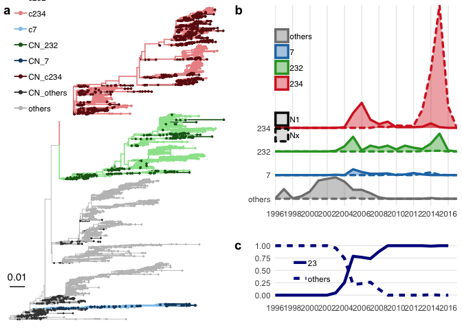
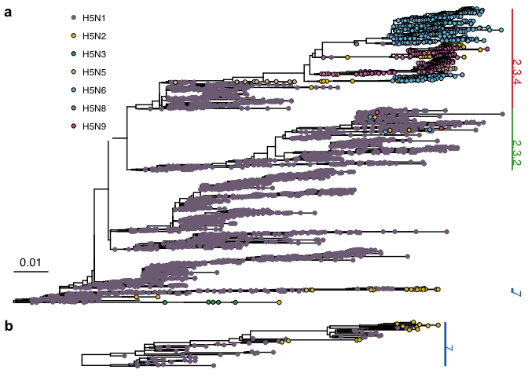
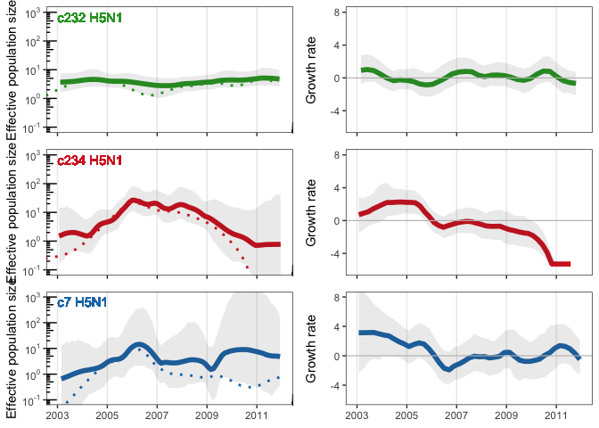
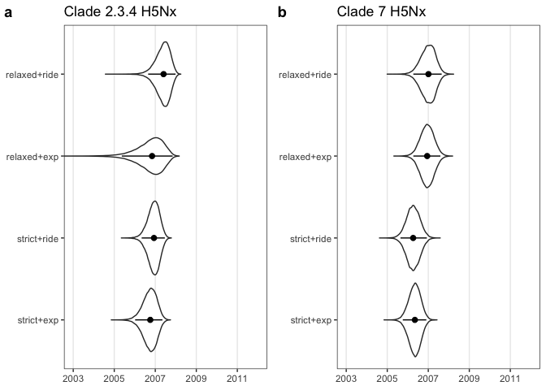
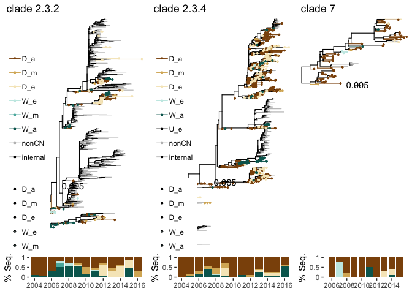

``` r
source( "./function.R" )
require( ape )
require( tidyverse )
require( ggtree )
require( ggpubr )
require( seqinr )
require( HDInterval )
require( ggridges )
require( lubridate )
```

### Sup 1. Evolution of GsGD H5 influenza viruses.

``` r
gsgd_rmdptre      <- taxaInfo( "./gsgd/out/raxml_pH5_gsgd.tre", useTree = TRUE )
gsgd_rmdptre[[7]][ is.na( gsgd_rmdptre[[7]] ) ] <- "others"
gsgd_rmdptre[[7]] <- c( "others", "234", "232", "7")[ match( gsgd_rmdptre[[7]], unique( gsgd_rmdptre[[7]] ) ) ]

table0 <- data.frame( sero = gsgd_rmdptre[[3]], geo  = gsgd_rmdptre[[2]],
                      yr   = gsgd_rmdptre[[4]], anno = gsgd_rmdptre[[7]],
                      name = gsgd_rmdptre[[6]], stringsAsFactors = FALSE )

tb =
  table0                                                                              %>%
  select( sero, geo, yr, anno )                                                       %>%
  mutate( China = ifelse( geo == "China" | geo == "Hong_Kong", "China", "others" ) )  %>%
  mutate( N1 = ifelse( sero == "H5N1", "N1", "Nx" ) ) %>%
  select( N1, yr, anno, China )

# big tree ----
gsgd_rawtr <- read.nexus( "gsgd/out/raxml_pH5_gsgd.tre" )
trefile    <- as.data.frame( fortify( gsgd_rawtr ) )

c234   <- c( 4777, getDes( tre.d = trefile, node = 4777) )
c232   <- c( 6396, getDes( tre.d = trefile, node = 6396) )
c7     <- c( 9284, getDes( tre.d = trefile, node = 9284) )
geo_CN <- grep( "China|Hong_Kong", trefile$label )

c234.CN <- intersect( c234, geo_CN  )
c232.CN <- intersect( c232, geo_CN  )
c7.CN   <- intersect( c7, geo_CN  )
o.CN    <- setdiff( geo_CN, c( c234, c232, c7 ) )

trefile[, 10 ] <- "others"
trefile[, 11 ] <- 0.3

colnames( trefile )[ 10 ] <- "branch.col"
colnames( trefile )[ 11 ] <- "branch.size"

trefile$branch.col[ c234 ]    <- "c234"
trefile$branch.col[ c234.CN ] <- "CN_c234"
trefile$branch.col[ c232 ]    <- "c232"
trefile$branch.col[ c232.CN ] <- "CN_232"
trefile$branch.col[ c7 ]      <- "c7"
trefile$branch.col[ c7.CN ]   <- "CN_7"
trefile$branch.col[ o.CN ]    <- "CN_others"

trefile$branch.size[ c(c234, c232, c7) ] <- 0.6

s1a <-
ggtree( gsgd_rawtr ) %<+% trefile + aes( color = branch.col, size = I(branch.size) ) +

  theme_tree( legend.position = c(0.15,0.85),
              legend.title = element_blank(),
              text = element_text(family = "Helvetica")) +

  geom_treescale( wid = 0.01, x = 0, y = 500, offset = 100) +
  scale_y_continuous( expand = c(0.01, 0) ) +
  scale_x_continuous( expand = c(0.01, 0) ) +
  geom_tippoint( aes( fill = branch.col, shape = branch.col, color = branch.col) ) +

  scale_fill_manual( values = c("#9be39b", "#eb9394", "#92c7ed",
                                 "#1c641c","#12476d", "#6c1414",
                                 "#404040", "#bfbfbf" ) ) +
  scale_color_manual( values = c("#9be39b", "#eb9394", "#92c7ed",
                                "#1c641c","#12476d", "#6c1414",
                                "#404040", "#bfbfbf" ) ) +
  scale_shape_manual( values = rep( 21, 8) )


tb$yr    <- floor( tb$yr )
tbb      <- data.frame( table(tb), stringsAsFactors = FALSE)
tbb$yr   <- as.numeric( as.character( tbb$yr ) )
tbb$anno <- factor( tbb$anno, levels = c("others", "7", "232", "234" ) )


# ggridge ----
s1b <- 
  tbb %>%
  filter( China == "China" ) %>%
  ggplot( aes( x = yr, y = anno, height = Freq, fill = anno, linetype =  N1, color = anno) ) +
  geom_density_ridges( stat = "identity", scale = 5.2, size = 1.2, alpha = .4) +

  scale_x_continuous( limit  = c(1996, 2017),
                      breaks = seq(1996, 2016, by = 2), labels = seq(1996, 2016, by = 2),
                      expand = c(0.001, 0)) +

  scale_y_discrete( expand = c(0.1, 0) ) +
  scale_fill_manual( values = c( pyCol( c( "gray", "blue", "green", "red") ) ) ) +
  scale_color_manual( values = c( pyCol( c( "gray", "blue", "green", "red") ) ) ) +
  theme_minimal() +
  theme( text = element_text(family = "Helvetica"),
         panel.grid.minor = element_blank(),
         strip.background = element_rect( fill = "white", color = "white "),
         legend.title = element_blank(),
         legend.position = c(0.1,0.6) ) +
  labs(x = "", y = "")


# proportion ----
tbp      <- tb
tbp$anno <- ifelse( tbp$anno == "232" | tbp$anno == "234" | tbp$anno == "7", "23", "others")
tbp      <- tbp[ which( tbp$China == "China" ), ]
tbp <- tbp[ ,c(2,3)]

tbp    <- as.data.frame( prop.table( table( tbp ), margin = 1)  )
tbp$yr <- as.numeric( as.character(tbp$yr) )

s1c <-
ggplot( data = tbp ) +
  geom_line(aes( x = yr, y = Freq, linetype = anno, group = anno ), size = 1.5, color = "darkblue") +
  labs(x = "", y = "") +   theme_minimal() +
  scale_x_continuous( limit = c(1996, 2017),
                      breaks = seq(1996, 2016, by = 2), labels = seq(1996, 2016, by = 2),
                      expand = c(0, 0.001) ) +

  scale_y_continuous( expand = c(0.1, 0) ) +
  theme( panel.grid.minor   = element_blank(),
         panel.grid.major.x = element_blank(),
         legend.title = element_blank(),
         legend.position = c(0.2,0.5) )

ggarrange( s1a, 
           ggarrange( s1b, s1c, nrow = 2, ncol = 1, align = 'v', heights = c(2.5, 1), labels = c("b", "c")), 
           nrow = 1, ncol = 2, labels = c("a") )
```

<!-- -->

``` r
#ggsave( "rplot.pdf", width = 8, height = 5, units = "in", device = "pdf", useDingbats = FALSE )
```

### Sup 2. Distribution of different subtypes of GsGD H5 viruses.

``` r
gsgd_rawtr  <- read.nexus("gsgd/out/raxml_pH5_gsgd.tre" )
trefile.sub <- fortify( gsgd_rawtr )

trefile.sub[ ncol( trefile.sub ) + 1 ] <- str_match( trefile.sub$label, pattern = "_(H5N[0-9])_[12]" )[,2]
colnames( trefile.sub )[ ncol( trefile.sub ) ] = "subtype"

s2a <- 
ggtree( gsgd_rawtr ) %<+% trefile.sub + 
  
  theme_tree( legend.position = c(0.15,0.78), 
              legend.title = element_blank(), 
              text = element_text(family = "Helvetica")) +
  
  geom_tippoint( aes( fill = subtype, shape = subtype, color = subtype) )+
  geom_treescale( wid = 0.01, x = 0, y = 500, offset = 100) +
  scale_y_continuous( expand = c(0.01, 0) ) +
  scale_x_continuous( expand = c(0.01, 0) ) +
  scale_fill_manual( values = c( "#7f6e85", "#e1c72f", "#48a365", "#ccc197", "#77bedb", 
                                  "#cc79a7", "#d0694a" ) ) + 
  scale_colour_manual( values = c( "#7f6e85", rep( "black", 6)  ) ) +
  scale_shape_manual( values = c( 21, 21, 21, 21, 21, 21, 21 ) ) + 
  geom_cladelabel( node = 9284, label = "7",  barsize = 1, angle = 270, align = T, color = pyCol("blue")) +
  geom_cladelabel( node = 4777, label = "2.3.4",  barsize = 0.6, angle = 270, align = T, color = pyCol("red")) +
  geom_cladelabel( node = 6396, label = "2.3.2",  barsize = 0.6, angle = 270, align = T, color = pyCol("green")) 


sub7_rawtr <- read.nexus("clade7/out/raxml_pH5_c7.tre" )
trefile.c7 <- fortify( sub7_rawtr )

trefile.c7[ ncol( trefile.c7 ) + 1 ] <- str_match( trefile.c7$label, pattern = "_(H5N[0-9])_[12]" )[,2]
colnames( trefile.c7 )[ ncol( trefile.c7 ) ] = "subtype"

s2b <- 
  ggtree( sub7_rawtr ) %<+% trefile.c7 + 
  
  theme_tree( legend.title = element_blank(), 
              text = element_text(family = "Helvetica")) +
  
  geom_tippoint( aes( fill = subtype, shape = subtype, color = subtype) )+
  scale_x_continuous( expand = c(0.2, 0) ) +
  scale_fill_manual( values = c( "#7f6e85", "#e1c72f" ) ) + 
  scale_colour_manual( values = c( "#7f6e85", "black" ) ) +
  scale_shape_manual( values = c( 21, 21 ) )  +
  geom_cladelabel( node = 75, label = "7",  barsize = 1, angle = 270, align = T, color = pyCol("blue")) 

s2c = flip( s2b, 134, 123  )  
  
ggarrange( s2a, s2c, nrow = 2, heights = c(1,0.2), labels = c( "a", "b" )) 
```

<!-- -->

``` r
#ggsave( "rplot.pdf", width = 4, height = 5, units = "in", device = "pdf", useDingbats = FALSE )
```

### Sup 3. Population dynamics of the three clades based on N1 gene.

``` r
n1_232 <- data.frame( read.table("./beast/dynamics/skygrid/grid_232_n1", sep = "\t", header = T), Gene = "N1", Clade = "232" )
n1_234 <- data.frame( read.table("./beast/dynamics/skygrid/grid_234_n1", sep = "\t", header = T), Gene = "N1", Clade = "234" )
n1_7   <- data.frame( read.table("./beast/dynamics/skygrid/grid_7_n1", sep = "\t", header = T), Gene = "N1", Clade = "7" )

tb.n1 = list( n1_232, n1_234, n1_7 ) 
tb.n1 = do.call( rbind, tb.n1 )

c232.na_nwk    <- "./beast/dynamics/nwk/grid_232_n1.nwk"
c234.na_nwk    <- "./beast/dynamics/nwk/grid_234_n1.nwk"
c7.na_nwk      <- "./beast/dynamics/nwk/grid_7_n1.nwk"

t_c232_D <- 2013.879
t_c234_D <- 2011.953
t_7_D    <- 2013.153

# tb.g.n1 = skygrowth_df( ls.nwk = c( c232.na_nwk, c234.na_nwk, c7.na_nwk ), 
#                         ls.t   = c( t_c232_D, t_c234_D, t_7_D ), 
#                         name   = c( "232", "234", "7" ), n.res = 50) 
# write.csv( tb.g.n1, file = "./beast/dynamics/skygrowth_na.csv", row.names = FALSE)

tb.g.n1 <- read.csv( "./beast/dynamics/skygrowth_na.csv", header = TRUE, stringsAsFactors = FALSE )


# s2a ----
s2a.1 <- 
tb.n1 %>%
  filter( Gene == "N1" ) %>%
  filter( 2003 <= Time ) %>% 
  filter( Time <= 2012 ) %>% 
  filter( Clade == "232" ) %>% 
  select( Median, Time, Upper, Lower ) %>%
  ggplot(  ) + theme_bw() +
  geom_line( aes( x = Time, y = Median ), size = 2, color = pyCol("green")) +
  geom_ribbon( aes( x = Time, ymin = Lower, ymax = Upper ), alpha = 0.1) +
  coord_cartesian( ylim = c( 0.1, 1000 ), xlim = c(2003, 2012) ) +
  
  geom_line( data = tb.g.n1[ which( tb.g.n1$note == "232" &  tb.g.n1$type == "mcmc" &  tb.g.n1$time <= 2012), ], 
             aes( x = time, y = e), size = 1, linetype = "dotted", color = pyCol("green") ) +
  # geom_ribbon( data = tb.g.n1[ which( tb.g.n1$note == "232" &  tb.g.n1$type == "mcmc" &  tb.g.n1$time <= 2012), ],
  #              aes( x = time, ymin = lb , ymax = ub  ), alpha = 0.1) + 
  
  scale_y_log10( breaks = scales::trans_breaks("log10", function(x) 10^x),
                 labels = scales::trans_format("log10", scales::math_format(10^.x))  ) +
  annotation_logticks() +
  
  scale_x_continuous( breaks = seq(2003, 2011, by = 2), labels =  seq(2003, 2011, by = 2) ) +
  ylab( "Effective population size" ) + 
  theme( panel.grid.major.y  =  element_blank(), 
         panel.grid.minor    =  element_blank(),
         legend.position     = "none", 
         axis.title.x = element_blank(),
         axis.text.x = element_blank() ) + 

  geom_text( aes(  x = 2003, y = 1000 ), label = "c232 H5N1", 
             vjust = "inward", hjust ="inward", color = pyCol("green"))

s2a.2 <- 
tb.g.n1 %>%
  filter( type == "rate" ) %>% 
  filter( 2003 <= time ) %>% 
  filter( time <= 2012 ) %>% 
  filter( note == "232" ) %>% 
  select( lb, e, ub, time ) %>%
  ggplot() + theme_bw() +
  geom_line( aes( x = time, y = e ), size = 2, color = pyCol( "green" ) ) + 
  geom_ribbon( aes( x = time, ymin = lb, ymax = ub), alpha = 0.1) + 
  geom_hline( yintercept = 0, color = "gray", size = 0.4 ) +
  coord_cartesian( ylim = c(-6, 8), xlim = c(2003, 2012) ) +
  scale_x_continuous( breaks = seq(2003, 2011, by = 2), labels =  seq(2003, 2011, by = 2) ) +
  ylab( "Growth rate" ) +
  theme( panel.grid.major.y =  element_blank(), 
         panel.grid.minor    =  element_blank(),
         axis.title.x = element_blank(),
         axis.text.x = element_blank(),
         legend.position = "none" )  


# s2b ----
s2b.1 <- 
tb.n1 %>%
  filter( Gene == "N1" ) %>%
  filter( 2003 <= Time ) %>% 
  filter( Time <= 2012 ) %>% 
  filter( Clade == "234" ) %>% 
  select( Median, Time, Upper, Lower ) %>%
  ggplot(  ) + theme_bw() +
  geom_line( aes( x = Time, y = Median ), size = 2, color = pyCol("red")) +
  geom_ribbon( aes( x = Time, ymin = Lower, ymax = Upper ), alpha = 0.1) +
  coord_cartesian( ylim = c( 0.1, 1000 ), xlim = c(2003, 2012) ) +
  
  geom_line( data = tb.g.n1[ which( tb.g.n1$note == "234" &  tb.g.n1$type == "mcmc" &  tb.g.n1$time <= 2012), ], 
             aes( x = time, y = e), size = 1, linetype = "dotted", color = pyCol("red") ) +
  # geom_ribbon( data = tb.g.n1[ which( tb.g.n1$note == "232" &  tb.g,n1$type == "mcmc" &  tb.g.n1$time <= 2012), ],
  #              aes( x = time, ymin = lb , ymax = ub  ), alpha = 0.1) + 
  
  scale_y_log10( breaks = scales::trans_breaks("log10", function(x) 10^x),
                 labels = scales::trans_format("log10", scales::math_format(10^.x))  ) +
  annotation_logticks() +
  
  scale_x_continuous( breaks = seq(2003, 2011, by = 2), labels =  seq(2003, 2011, by = 2) ) +
  ylab( "Effective population size" ) + 
  theme( panel.grid.major.y  =  element_blank(), 
         panel.grid.minor    =  element_blank(),
         legend.position     = "none", 
         axis.title.x = element_blank(),
         axis.text.x = element_blank() ) + 

  geom_text( aes(  x = 2003, y = 1000 ), label = "c234 H5N1", 
             vjust = "inward", hjust ="inward", color = pyCol("red"))

s2b.2 <- 
tb.g.n1 %>%
  filter( type == "rate" ) %>% 
  filter( 2003 <= time ) %>% 
  filter( time <= 2012 ) %>% 
  filter( note == "234" ) %>% 
  select( lb, e, ub, time ) %>%
  ggplot() + theme_bw() +
  geom_line( aes( x = time, y = e ), size = 2, color = pyCol( "red" ) ) + 
  geom_ribbon( aes( x = time, ymin = lb, ymax = ub), alpha = 0.1) + 
  geom_hline( yintercept = 0, color = "gray", size = 0.4 ) +
  coord_cartesian( ylim = c(-6, 8), xlim = c(2003, 2012) ) +
  scale_x_continuous( breaks = seq(2003, 2011, by = 2), labels =  seq(2003, 2011, by = 2) ) +
  ylab( "Growth rate" ) +
  theme( panel.grid.major.y =  element_blank(), 
         panel.grid.minor    =  element_blank(),
         axis.title.x = element_blank(),
         axis.text.x = element_blank(),
         legend.position = "none" )  


# s2c ----
s2c.1 <- 
tb.n1 %>%
  filter( Gene == "N1" ) %>%
  filter( 2003 <= Time ) %>% 
  filter( Time <= 2012 ) %>% 
  filter( Clade == "7" ) %>% 
  select( Median, Time, Upper, Lower ) %>%
  ggplot(  ) + theme_bw() +
  geom_line( aes( x = Time, y = Median ), size = 2, color = pyCol("blue")) +
  geom_ribbon( aes( x = Time, ymin = Lower, ymax = Upper ), alpha = 0.1) +
  coord_cartesian( ylim = c( 0.1, 1000 ), xlim = c(2003, 2012) ) +
  
  geom_line( data = tb.g.n1[ which( tb.g.n1$note == "7" &  tb.g.n1$type == "mcmc" &  tb.g.n1$time <= 2012), ], 
             aes( x = time, y = e), size = 1, linetype = "dotted", color = pyCol("blue") ) +
  # geom_ribbon( data = tb.g.n1[ which( tb.g.n1$note == "232" &  tb.g.n1$type == "mcmc" &  tb.g.n1$time <= 2012), ],
  #              aes( x = time, ymin = lb , ymax = ub  ), alpha = 0.1) + 
  
  scale_y_log10( breaks = scales::trans_breaks("log10", function(x) 10^x),
                 labels = scales::trans_format("log10", scales::math_format(10^.x))  ) +
  annotation_logticks() +
  
  scale_x_continuous( breaks = seq(2003, 2011, by = 2), labels =  seq(2003, 2011, by = 2) ) +
  ylab( "Effective population size" ) + 
  theme( panel.grid.major.y  =  element_blank(), 
         panel.grid.minor    =  element_blank(),
         legend.position     = "none", 
         axis.title.x = element_blank() ) + 

  geom_text( aes(  x = 2003, y = 1000 ), label = "c7 H5N1", 
             vjust = "inward", hjust ="inward", color = pyCol("blue"))

s2c.2 <- 
tb.g.n1 %>%
  filter( type == "rate" ) %>% 
  filter( 2003 <= time ) %>% 
  filter( time <= 2012 ) %>% 
  filter( note == "7" ) %>% 
  select( lb, e, ub, time ) %>%
  ggplot() + theme_bw() +
  geom_line( aes( x = time, y = e ), size = 2, color = pyCol( "blue" ) ) + 
  geom_ribbon( aes( x = time, ymin = lb, ymax = ub), alpha = 0.1) + 
  geom_hline( yintercept = 0, color = "gray", size = 0.4 ) +
  coord_cartesian( ylim = c(-6, 8), xlim = c(2003, 2012) ) +
  scale_x_continuous( breaks = seq(2003, 2011, by = 2), labels =  seq(2003, 2011, by = 2) ) +
  ylab( "Growth rate" ) +
  theme( panel.grid.major.y =  element_blank(), 
         panel.grid.minor    =  element_blank(),
         axis.title.x = element_blank(),
         legend.position = "none" )


ggarrange( s2a.1, s2a.2, s2b.1, s2b.2, s2c.1, s2c.2,
           ncol = 2, nrow = 3, align = 'v')#, labels = c("a", "b") )  #5*5
```

    ## Warning: Removed 1 rows containing missing values (geom_path).

<!-- -->

### Sup 4. MRCA of reassortants.

``` r
mrca_c234 = read.table( "./beast/dynamics/c234h5nx_ha_mrca", header = TRUE)
mrca_c234 = mrca_c234[ ,c(1,2,4,6,8)]

mrca_c7   = read.table( "./beast/dynamics/c7h5nx_ha_mrca", header = TRUE)
mrca_c7   = mrca_c7[ ,c(1,2,4,6,8)]


df.234hdi = data.frame( m = rep( c( "se", "sr", "ue", "ur" ) ), 
                        u = c( hdi( mrca_c234$se, 0.95 )[[2]], hdi( mrca_c234$sr, 0.95 )[[2]], hdi( mrca_c234$ue, 0.95 )[[2]], hdi( mrca_c234$ur, 0.95 )[[2]] ),
                        l = c( hdi( mrca_c234$se, 0.95 )[[1]], hdi( mrca_c234$sr, 0.95 )[[1]], hdi( mrca_c234$ue, 0.95 )[[1]], hdi( mrca_c234$ur, 0.95 )[[1]] ),
                        stringsAsFactors = FALSE)
v1 <- 
mrca_c234 %>% 
  gather( method, value, se:ur ) %>% 
  ggplot( aes( x = method, y = 2013.989 - value  ) ) + 
  geom_violin( ) + 
  theme_bw() +
  stat_summary( fun.y = median, geom = "point", size = 2) + 
  geom_errorbar( data = df.234hdi, aes( x = m, ymin = 2013.989-l, ymax = 2013.989-u ), inherit.aes = FALSE, width = 0) +
  scale_y_continuous( breaks = seq(2003, 2011, by = 2), labels =  seq(2003, 2011, by = 2) ) + 
  scale_x_discrete( labels = c( "strict+exp", "strict+ride", "relaxed+exp", "relaxed+ride"), breaks = c( "se", "sr", "ue", "ur") ) +
  theme( axis.title.x = element_blank(), 
         axis.title.y = element_blank(),
         panel.grid.minor.x = element_blank(),
         panel.grid.major.y  = element_blank() ) +
  coord_flip( ylim = c(2003, 2012) ) + 
  ggtitle("Clade 2.3.4 H5Nx")
  

 
df.7hdi = data.frame( m = rep( c( "se", "sr", "ue", "ur" ) ), 
                        u = c( hdi( mrca_c7$se, 0.95 )[[2]], hdi( mrca_c7$sr, 0.95 )[[2]], hdi( mrca_c7$ue, 0.95 )[[2]], hdi( mrca_c7$ur, 0.95 )[[2]] ),
                        l = c( hdi( mrca_c7$se, 0.95 )[[1]], hdi( mrca_c7$sr, 0.95 )[[1]], hdi( mrca_c7$ue, 0.95 )[[1]], hdi( mrca_c7$ur, 0.95 )[[1]] ),
                        stringsAsFactors = FALSE)
v2 <- 
  mrca_c7 %>% 
  gather( method, value, se:ur ) %>% 
  ggplot( aes( x = method, y = 2015.038 - value  ) ) + 
  geom_violin( ) + 
  theme_bw() +
  stat_summary( fun.y = median, geom = "point", size = 2) + 
  geom_errorbar( data = df.7hdi, aes( x = m, ymin = 2015.038-l, ymax = 2015.038-u ), inherit.aes = FALSE, width = 0) +  
  scale_y_continuous( breaks = seq(2003, 2011, by = 2), labels =  seq(2003, 2011, by = 2) ) + 
  scale_x_discrete( labels = c( "strict+exp", "strict+ride", "relaxed+exp", "relaxed+ride"), breaks = c( "se", "sr", "ue", "ur") ) +
  theme( axis.title.x = element_blank(), 
         axis.title.y = element_blank(),
         panel.grid.minor.x = element_blank(),
         panel.grid.major.y  = element_blank() ) +
  coord_flip( ylim = c(2003, 2012) )+
  ggtitle("Clade 7 H5Nx")
                

ggarrange( v1, v2, ncol = 2, labels = c("a","b") ) #5*4
```

<!-- -->

``` r
# table 

df.234hdi$med = apply( mrca_c234[, c(2:5)], 2, median )
df.7hdi$med   = apply( mrca_c7[, c(2:5)], 2, median )

date_234.1 = gsub( "-", "/", substr( date_decimal( 2013.989 - df.234hdi$med ), 1, 10 ) )
date_234.2 = gsub( "-", "/", substr( date_decimal( 2013.989 - df.234hdi$u ), 1, 10 ) )
date_234.3 = gsub( "-", "/", substr( date_decimal( 2013.989 - df.234hdi$l ), 1, 10 ) )
date_234   = paste0( date_234.1, " (", date_234.2, " - ", date_234.3, ")")

date_7.1 = gsub( "-", "/", substr( date_decimal( 2015.038 - df.7hdi$med ), 1, 10 ) )
date_7.2 = gsub( "-", "/", substr( date_decimal( 2015.038 - df.7hdi$u ), 1, 10 ) )
date_7.3 = gsub( "-", "/", substr( date_decimal( 2015.038 - df.7hdi$l ), 1, 10 ) )
date_7   = paste0( date_7.1, " (", date_7.2, " - ", date_7.3, ")")

date_table = data.frame( clade234 = date_234, clade7 = date_7  )
rownames( date_table ) = c( "strict+exp", "strict+ride", "relaxed+exp", "relaxed+ride")
colnames( date_table ) = c( "Clade 2.3.4 (95% HPD)", "Clade 7 (95% HPD)"  )

#write.csv( date_table, "./others/supp_tmrca.csv" )
```

### Sup 5. Distribution of ecological sources of GsGD H5 viruses.

``` r
rawtre.c234 <- "./gsgd/out/raxml_pH5_c234.tre"
rawtre.c232 <- "./gsgd/out/raxml_pH5_c232.tre"
rawtre.c7   <- "./clade7/out/raxml_pH5_c7.tre"

refcsv.c234 <- read.csv( "./state/out/eco_234.csv", header = TRUE, stringsAsFactors = FALSE )
refcsv.c232 <- read.csv( "./state/out/eco_232.csv", header = TRUE, stringsAsFactors = FALSE )
refcsv.c7   <- read.csv( "./state/out/eco_7.csv", header = TRUE, stringsAsFactors = FALSE )


# c234 ml -----
tre.c234   <- read.nexus( rawtre.c234 )
refdf.c234 <- fortify( tre.c234 )

refdf.c234[ ncol(refdf.c234) + 1 ] <- refcsv.c234$states[ match( gsub( "'", "", refdf.c234$label ), refcsv.c234$name ) ]
colnames( refdf.c234 )[ ncol(refdf.c234) ] <- "eco"
refdf.c234$eco[ is.na(refdf.c234$eco) & refdf.c234$isTip ] <- "nonCN"
refdf.c234$eco[ is.na(refdf.c234$eco) ] <- "internal"
refdf.c234$eco                          <- factor( x      = refdf.c234$eco, levels = c("D_a", "D_m", "D_e", "W_e", "W_a","U_e", "nonCN", "internal") )

s5a1 = 
ggtree( tre.c234, ladderize = FALSE, size = 0.4 ) %<+% refdf.c234 + aes( color = eco ) +
  geom_tippoint( aes( fill = eco, shape = eco, color = eco), size = 0.7) +
  scale_shape_manual( values = c( rep( 21, 6), NA) ) +
  scale_fill_manual( values = c( "#8c510a", "#d8b365", "#f6e8c3", "#c7eae5", "#01665e", "black", "gray" ) ) +
  scale_color_manual( values = c( "#8c510a", "#d8b365", "#f6e8c3", "#c7eae5", "#01665e", "black", "gray", "black") ) +
  geom_treescale( width = 0.005, offset = -25, x = 0.045, y = 455) + 
  scale_y_continuous( expand = c(0,0) ) +
  scale_x_continuous( expand = c(0,0.0005) ) + 
  theme_tree( legend.position = c(0.15,0.35), 
              legend.title = element_blank() ) +
  ggtitle("clade 2.3.4")


# c232 ml -----
tre.c232   <- read.nexus( rawtre.c232 )
refdf.c232 <- fortify( tre.c232 )

refdf.c232[ ncol(refdf.c232) + 1 ] <- refcsv.c232$states[ match( gsub( "'", "", refdf.c232$label ), refcsv.c232$name ) ]
colnames( refdf.c232 )[ ncol(refdf.c232) ] <- "eco"
refdf.c232$eco[ is.na(refdf.c232$eco) & refdf.c232$isTip ] <- "nonCN"
refdf.c232$eco[ is.na(refdf.c232$eco) ] <- "internal"
refdf.c232$eco                          <- factor( x      = refdf.c232$eco, levels = c("D_a", "D_m", "D_e", "W_e", "W_m", "W_a", "nonCN", "internal") )


s5b1 = 
  ggtree( tre.c232, ladderize = FALSE, size = 0.4 ) %<+% refdf.c232 + aes( color = eco ) +
  geom_tippoint( aes( fill = eco, shape = eco, color = eco), size = 0.7) +
  scale_shape_manual( values = c( rep( 21, 6), NA) ) +
  scale_fill_manual( values = c( "#8c510a", "#d8b365", "#f6e8c3", "#c7eae5", "#5ab4ac", "#01665e", "gray" ) ) +
  scale_color_manual( values = c( "#8c510a", "#d8b365", "#f6e8c3", "#c7eae5", "#5ab4ac", "#01665e", "gray", "black") ) +
  geom_treescale( width = 0.005, offset = -15, x = 0.045, y = 260) + 
  scale_y_continuous( expand = c(0,0) ) + 
  scale_x_continuous( expand = c(0,0.0005) ) + 
  theme_tree( legend.position = c(0.15,0.35), 
              legend.title = element_blank() ) +
  ggtitle("clade 2.3.2")


# c7 ml ------
tre.c7   <- read.nexus( rawtre.c7 )
refdf.c7 <- fortify( tre.c7 )

refdf.c7[ ncol(refdf.c7) + 1 ]         <- refcsv.c7$states[ match( gsub( "'", "", refdf.c7$label ), refcsv.c7$name ) ]
colnames( refdf.c7 )[ ncol(refdf.c7) ] <- "eco"
refdf.c7$eco[ is.na(refdf.c7$eco) & refdf.c7$isTip ] <- "nonCN"
refdf.c7$eco[ is.na(refdf.c7$eco) ] <- "internal"
refdf.c7$eco                        <- factor( x     = refdf.c7$eco, levels = c("D_a", "D_m", "D_e", "W_e", "W_a", "nonCN", "internal") )


s5c1 = 
  ggtree( tre.c7, ladderize = FALSE, size = 0.4 ) %<+% refdf.c7 + aes( color = eco ) +
  geom_tippoint( aes( fill = eco, shape = eco, color = eco), size = 0.7) +
  scale_shape_manual( values = c( rep( 21, 5), NA) ) +
  scale_fill_manual( values = c( "#8c510a", "#d8b365", "#f6e8c3", "#c7eae5", "#01665e", "gray" ) ) +
  scale_color_manual( values = c( "#8c510a", "#d8b365", "#f6e8c3", "#c7eae5", "#01665e", "gray", "black") ) +
  geom_treescale( width = 0.005, offset = -3) + 
  scale_y_continuous( expand = c(0,0) ) + 
  scale_x_continuous( expand = c(0,0.0005) ) + 
  theme_tree( legend.position = "NULL" ) +
  ggtitle("clade 7")


# c234 eco dist. ------
table_234_species        <- as.data.frame( prop.table( table( refcsv.c234[,3], refcsv.c234[,5]), margin = 2) )
table_234_species$Var1   <- factor( table_234_species$Var1, levels = c("D_a", "D_m", "D_e", "U_e","W_e", "W_a") )
table_234_species$Var2   <- as.numeric( as.character(table_234_species$Var2) )

s5a2 <- 
  ggplot( data =  table_234_species, aes( x = Var2, y = Freq, fill = Var1) ) +
  geom_bar(stat = "identity") + 
  scale_x_continuous( limit = c(2003.5, 2016.5), 
                      breaks = seq(2004, 2016, by = 2), 
                      labels = seq(2004, 2016, by = 2),
                      expand = c(0,0.1)) +
  scale_y_continuous( breaks = c(0, 0.5, 1), 
                      labels = c(0, 0.5, 1)) +
  theme( panel.background = element_blank() ) + ylab("% Seq.") + 
  scale_fill_manual( values = c( "#8c510a", "#d8b365", "#f6e8c3", "white", "#c7eae5", "#01665e") ) +
  theme( legend.title    = element_blank(), 
         axis.title.x    = element_blank(),
         legend.position = "none")


# c232 eco dist. ------
table_232_species        <- as.data.frame( prop.table( table( refcsv.c232[,3], refcsv.c232[,5] ), margin = 2) )
table_232_species$Var1   <- factor( table_232_species$Var1, levels = c("D_a", "D_m", "D_e", "W_e", "W_m", "W_a") )
table_232_species$Var2   <- as.numeric( as.character(table_232_species$Var2) )

s5b2 <- 
  ggplot( data =  table_232_species, aes( x = Var2, y = Freq, fill = Var1) ) +
  geom_bar(stat = "identity") + 
  scale_x_continuous( limit = c(2003.5, 2016.5), 
                      breaks = seq(2004, 2016, by = 2), 
                      labels = seq(2004, 2016, by = 2),
                      expand = c(0,0.1)) +
  scale_y_continuous( breaks = c(0, 0.5, 1), 
                      labels = c(0, 0.5, 1)) +
  theme( panel.background = element_blank() ) +
  xlab("") + ylab("% Seq.") + 
  scale_fill_manual( values = c( "#8c510a", "#d8b365", "#f6e8c3", "#c7eae5", "#5ab4ac", "#01665e") ) + 
  theme( legend.title    = element_blank(), 
         axis.title.x    = element_blank(),
         legend.position = "none")


# c7 eco dist. ------
table_7_species        <- as.data.frame( prop.table( table( refcsv.c7[,3], refcsv.c7[,5] ), margin = 2) )
table_7_species$Var1   <- factor( table_7_species$Var1, levels = c("D_a", "D_m", "D_e", "W_e", "W_m", "W_a") )
table_7_species$Var2   <- as.numeric( as.character(table_7_species$Var2) )

s5c2 <- 
  ggplot( data =  table_7_species, aes( x = Var2, y = Freq, fill = Var1) ) +
  geom_bar(stat = "identity") + 
  scale_x_continuous( limit = c(2005, 2016), 
                      breaks = seq(2004, 2015, by = 2), 
                      labels = seq(2004, 2015, by = 2),
                      expand = c(0,0.1)) +
  scale_y_continuous( breaks = c(0, 0.5, 1), 
                      labels = c(0, 0.5, 1)) +
  theme( panel.background = element_blank() ) +
  xlab("") + ylab("% Seq.")  + 
  scale_fill_manual( values = c( "#8c510a", "#d8b365", "#f6e8c3", "#c7eae5", "#01665e") ) + 
  theme( legend.title    = element_blank(), 
         axis.title.x    = element_blank(),
         legend.position = "none" )


# combine 
ggarrange( s5b1, s5a1, ggarrange( s5c1, nrow = 2, heights = c(0.6, 1)), widths = c(1,1,0.8), 
           s5b2, s5a2, s5c2, ncol = 3, 
           nrow = 2,  heights = c(6,1) ) 
```

<!-- -->

``` r
#ggsave( "rplot.pdf", width = 7.5, height = 5, units = "in", device = "pdf", useDingbats = FALSE )
```
